# OpenScout.ai — Application Flow & Architecture

> Visual architecture reference for the entire OpenScout.ai platform. Each diagram maps directly to PRD features and TECHNICAL_GUIDE specifications.

---

## 1. High-Level System Architecture

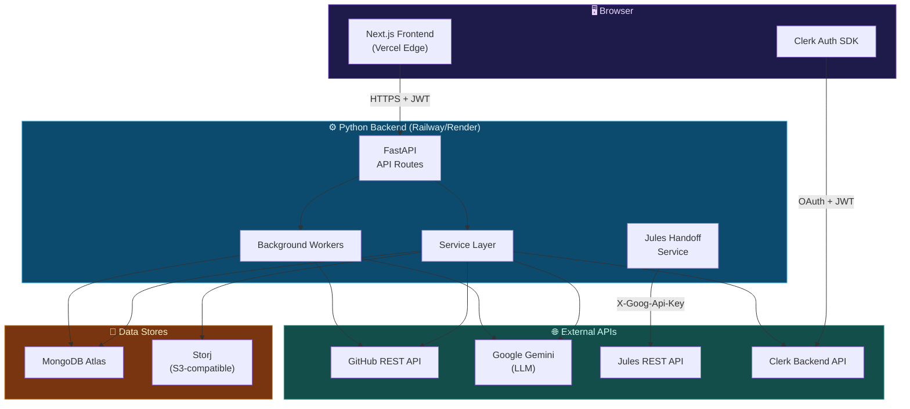

---

## 2. End-to-End User Journey

This is the primary product flow — every screen and API call maps to a step in this journey.

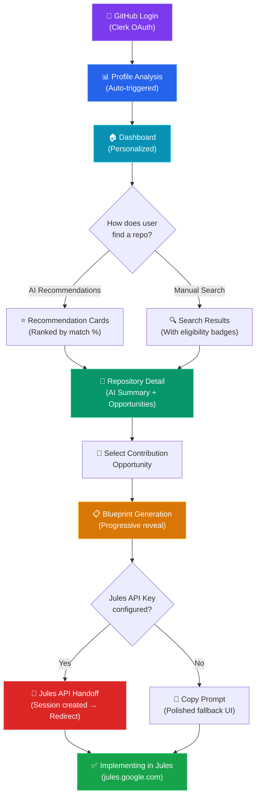

---

## 3. Authentication Flow (Clerk + GitHub OAuth)

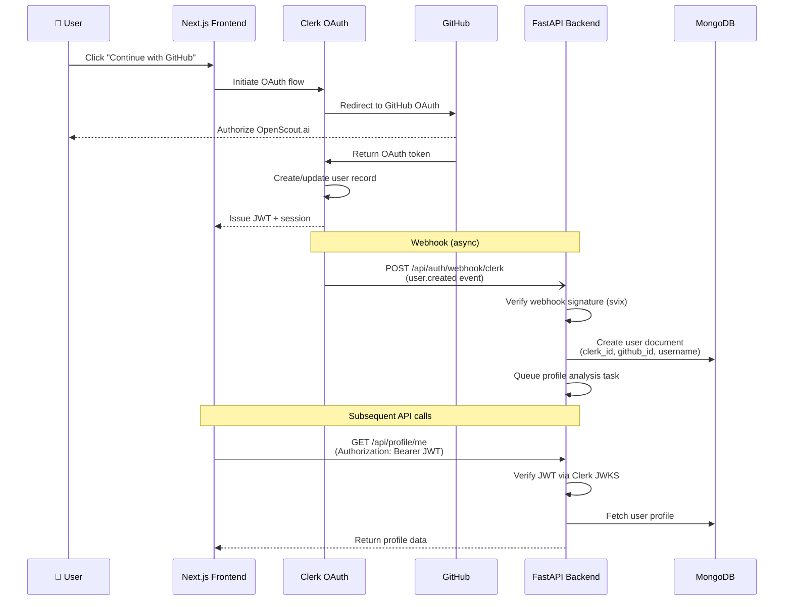

---

## 4. Profile Analysis Pipeline

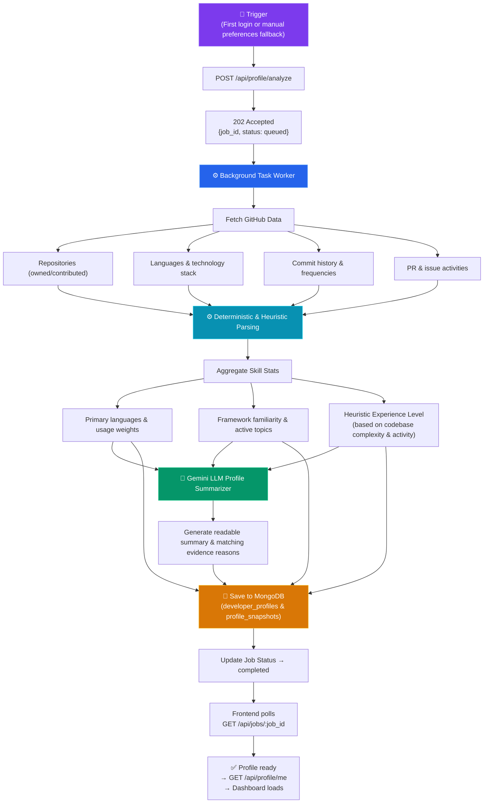

---

## 5. Recommendation Engine Flow

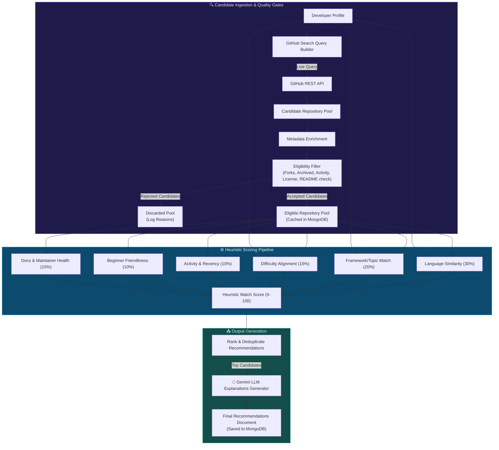

---

## 6. Repository Analysis & Opportunity Discovery

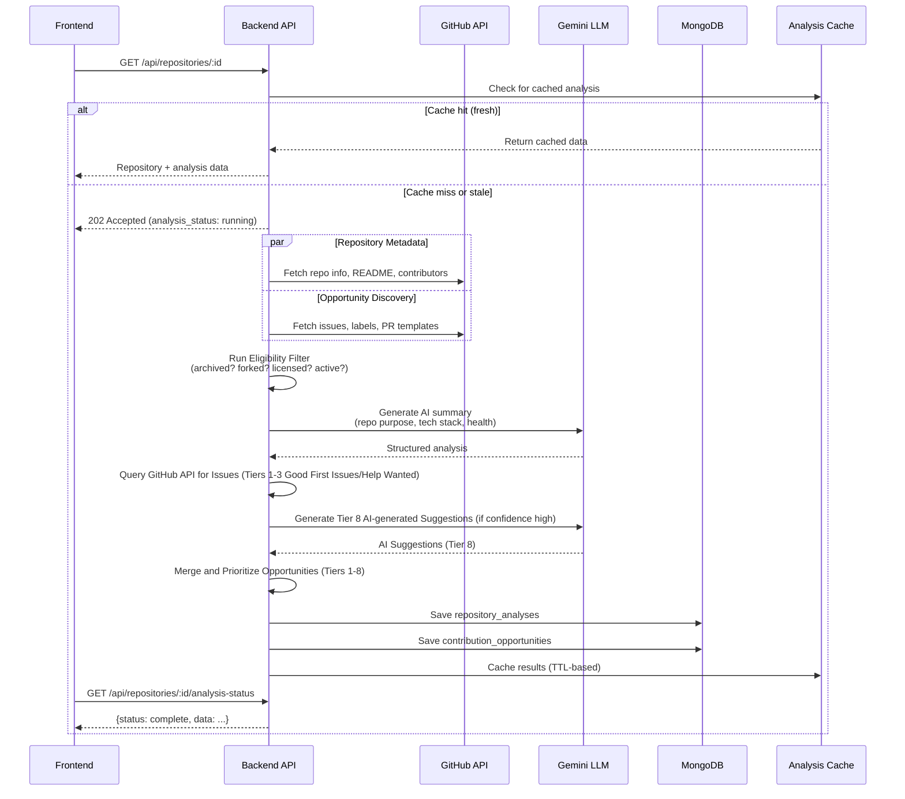

---

## 7. Blueprint Generation Flow

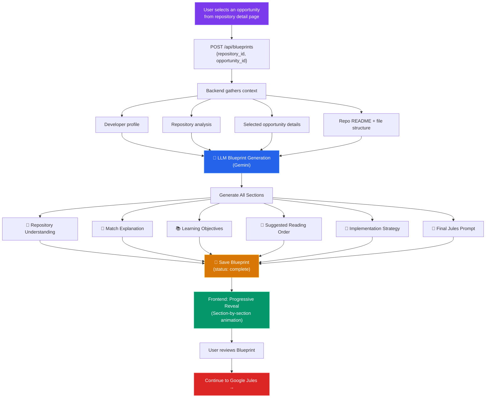

---

## 8. Jules API Handoff Flow (API-Driven)

This is the **primary KPI completion event** — the moment the user transitions from planning to implementation.

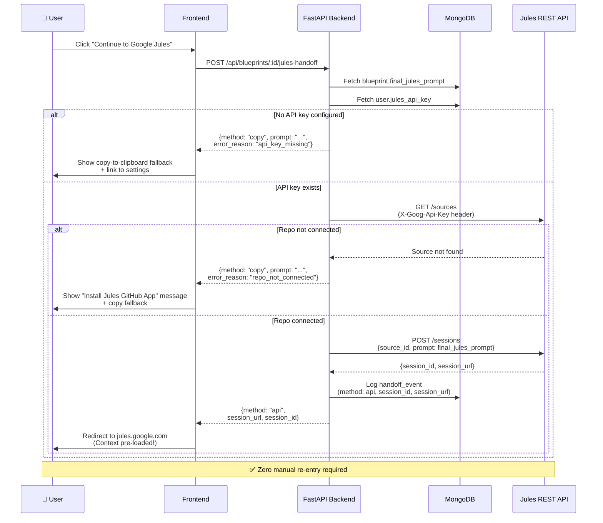

---

## 9. Frontend Page Architecture

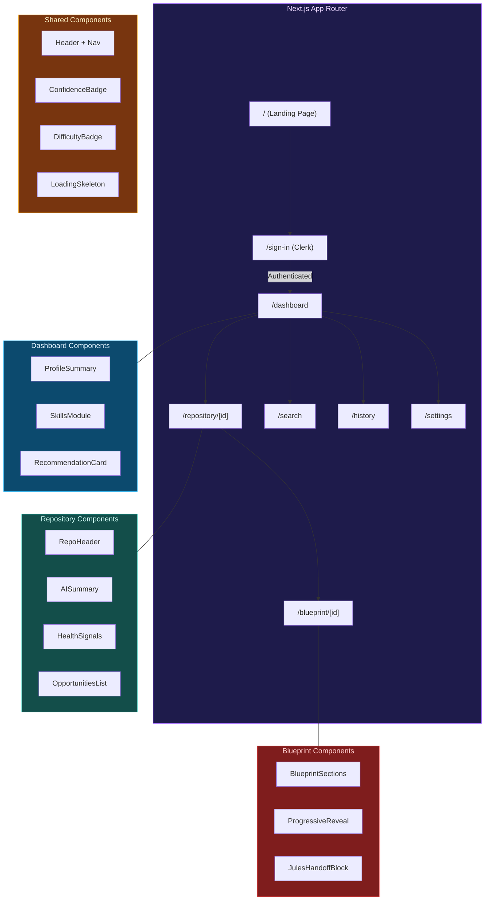

---

## 10. Backend Service Architecture

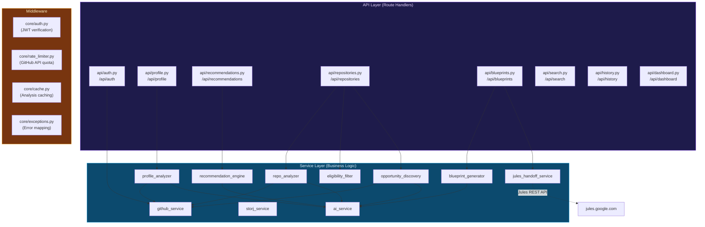

---

## 11. Database Entity Relationships

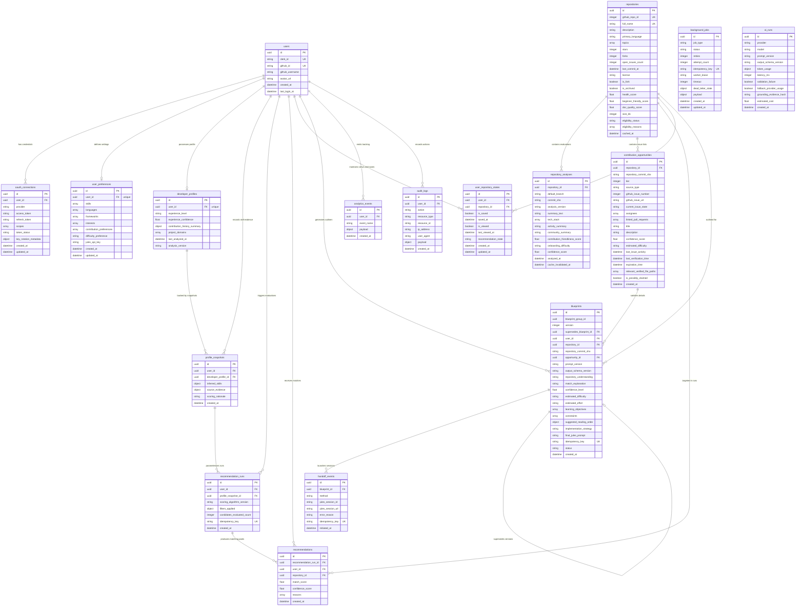

---

## 12. Deployment Topology

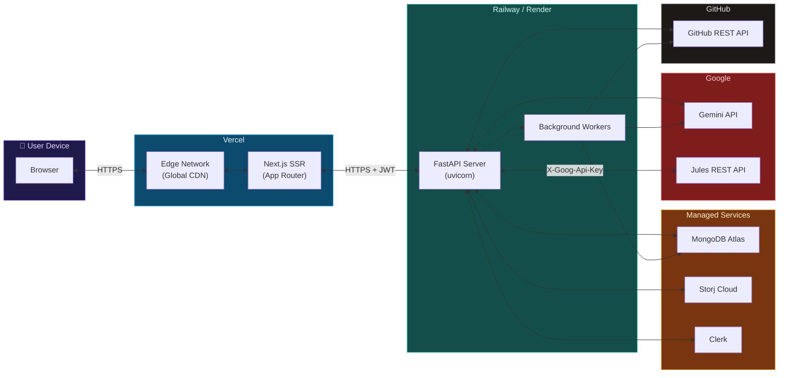

---

## Quick Reference — API Call Map

Which service calls which external API:

| Backend Service | GitHub API | Gemini LLM | Jules API | Clerk API | MongoDB | Storj |
|---|:---:|:---:|:---:|:---:|:---:|:---:|
| `github_service` | ✅ | | | | | |
| `profile_analyzer` | ✅ | ✅ | | | ✅ | |
| `recommendation_engine` | | ✅ | | | ✅ | |
| `eligibility_filter` | | | | | ✅ | |
| `repo_analyzer` | ✅ | ✅ | | | ✅ | |
| `opportunity_discovery` | ✅ | ✅ | | | ✅ | |
| `blueprint_generator` | | ✅ | | | ✅ | |
| `jules_handoff_service` | | | ✅ | | ✅ | |
| `storj_service` | | | | | | ✅ |
| `ai_service` | | ✅ | | | | |
| `core/auth.py` | | | | ✅ | | |

---

## 13. Background Job Lifecycle (Durable Jobs)

Durable tasks like profile analysis and recommendations generation track progress and leases through a database-backed state machine:

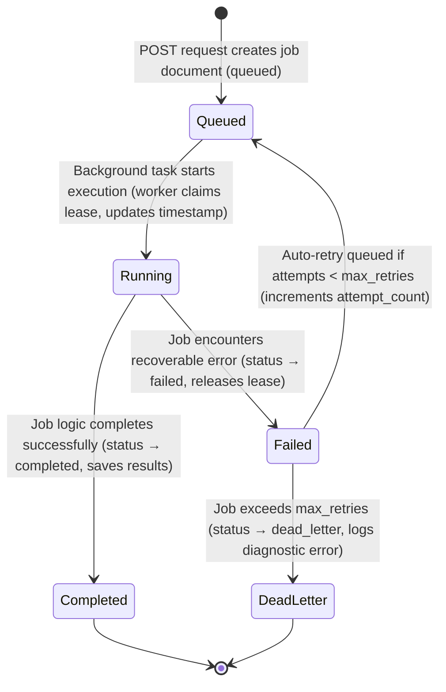

---

*This document provides the visual architecture companion to [TECHNICAL_GUIDE.md](file:///d:/OpenScout.ai-main/OpenScout.ai-main/OpenScout.ai/TECHNICAL_GUIDE.md) and [PRD.md](file:///d:/OpenScout.ai-main/OpenScout.ai-main/OpenScout.ai/PRD.md). All diagrams reflect the API-driven Jules integration strategy.*
